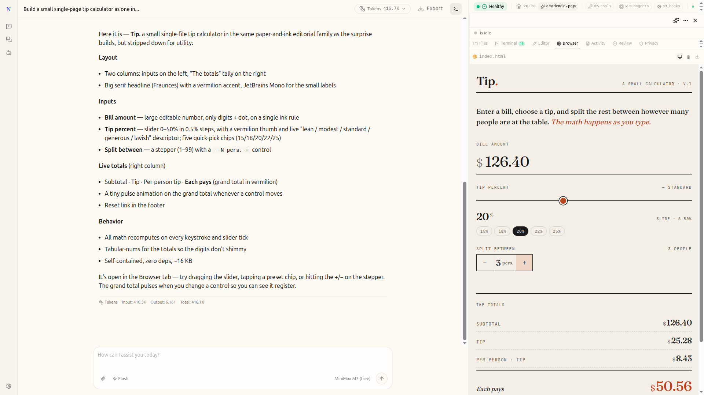

# Nova — 智能体的电脑

[English](./README.md) | 中文 | [日本語](./README_ja.md) | [Français](./README_fr.md) | [Русский](./README_ru.md)

[](./backend/pyproject.toml)
[](./Makefile)
[](./LICENSE)

**Nova** 是一个全栈 **电脑智能体**，能够研究、编码和创作。它编排 **子智能体**、**记忆** 和 **线程级沙箱**，几乎可以完成任何任务——由 **可扩展技能** 和实时流式视图驱动，展示智能体自己的电脑：终端、编辑器、浏览器预览和任务进度，全部实时呈现。

Nova 由 **[Ali Technologies](https://www.alilabsx.com)** 基于开源的 [DeerFlow](https://github.com/bytedance/deer-flow) 超级智能体框架构建。上游 MIT 许可证和所有原始版权声明均已保留——参见 [许可证](#许可证) 和 [NOTICE.md](./NOTICE.md)。

> 打个招呼：*"我是 Nova，电脑智能体。"*



## Nova 在 DeerFlow 之上的新增

Nova 是 DeerFlow 2.0 的全栈重构——**+35,738 行代码，跨 338 个文件**（已验证：`git diff --shortstat v2.0.0-rc1 HEAD`）。主要新增内容，全部为 Nova 构建：

- **Agent's Computer** — 6 标签实时面板（终端、编辑器带红/绿实时差异、浏览器预览、活动时间线、文件、代码审查），实时流式展示智能体的操作。
- **验证循环** — 智能体测试自己的构建：无头 Chromium 自检运行中的开发服务器（控制台错误、空白渲染检测、截图），在开发服务器就绪和交付 HTML 时自动触发，视觉路径让模型*看到*自己的构建。
- **确定性代码审查** — 无 LLM 审查引擎，为非技术人员提供纯英文结论，为开发者提供逐文件统计和风险标记。
- **自校正中间件** — 运行时强制的迭代预算、死循环检测、配额预检、错误消息净化、实时任务进度。
- **32 个智能体工具** — Shell 会话、浏览器导航/点击/输入/评估、截图、脚手架、开发服务器生命周期、dev_verify、code_review、技能保存等。
- **iGIN0 隐私研究** — 加固的 SearXNG 客户端，支持重试、断路器、LRU+TTL 缓存、可选 TOR 路由和隐私审计追踪。
- **运行时模型管理** — 通过 API 和设置 UI 添加/切换模型，无需修改配置文件。
- **运维层** — 11 探针自愈看门狗、PM2 管理的 Docker 生命周期、重启持久化。
- **本地 + 免费模型 via LiteLLM** — 设置中的 Ollama 预设和 PM2 管理的 LiteLLM 代理，暴露四个免费 Ollama 云模型（MiniMax M3、Nemotron 3 Super、Qwen3 Coder 480B、GPT-OSS 120B）以及付费提供商。
- **8,112 行新测试**，跨 37 个新后端测试文件。

上游 DeerFlow 提供了智能体框架（子智能体、记忆、LangGraph 运行时）、技能系统和线程级 Docker 沙箱——功劳归于上游。完整的可复现归因映射在 **[NOVA_VS_DEERFLOW.md](./NOVA_VS_DEERFLOW.md)** 中。

## 在 AMD 计算上运行

Nova 在 **AMD Instinct** GPU 上提供推理服务，并将其作为一流的一键选择——为 **AMD 开发者黑客松（Act II）** 构建。

- **两条 AMD 路径，作为设置中的预设** → 模型：**Fireworks AI**（托管，运行在 AMD Instinct MI300X 上）和 **AMD 开发者云**（Nova 自有推理 via **vLLM on ROCm**，`scripts/amd-serve-vllm.sh`）。添加 AMD 计算是配置，不是代码。
- **可验证使用** — `GET /api/models/amd-usage` 返回机器可读的 AMD 使用摘要，AMD 支持的模型显示 **AMD** 徽章。
- **Track 1 智能体** — [`hackathon/track1/`](./hackathon/track1/) 中的精简、token 高效的 Fireworks 批量框架；使用 `make hackathon-track1` 构建和冒烟测试。
- 完整设置 + AMD 计算文档：**[docs/AMD_INTEGRATION.md](./docs/AMD_INTEGRATION.md)**。

## 目录

- [Nova — 智能体的电脑](#nova--智能体的电脑)
  - [目录](#目录)
  - [一键智能体设置](#一键智能体设置)
  - [快速开始](#快速开始)
    - [配置](#配置)
    - [运行应用](#运行应用)
      - [部署规模](#部署规模)
      - [方式一：Docker（推荐）](#方式一docker推荐)
      - [方式二：本地开发](#方式二本地开发)
    - [高级](#高级)
      - [沙箱模式](#沙箱模式)
      - [MCP 服务器](#mcp-服务器)
      - [IM 频道](#im-频道)
      - [LangSmith 追踪](#langsmith-追踪)
      - [Langfuse 追踪](#langfuse-追踪)
  - [从深度研究到超级智能体框架](#从深度研究到超级智能体框架)
  - [核心功能](#核心功能)
    - [技能与工具](#技能与工具)
    - [子智能体](#子智能体)
    - [沙箱与文件系统](#沙箱与文件系统)
    - [上下文工程](#上下文工程)
    - [长期记忆](#长期记忆)
  - [推荐模型](#推荐模型)
  - [嵌入式 Python 客户端](#嵌入式-python-客户端)
  - [文档](#文档)
  - [⚠️ 安全提示](#️-安全提示)
  - [贡献](#贡献)
  - [许可证](#许可证)

## 一键智能体设置

如果你使用 Claude Code、Codex、Cursor、Windsurf 或其他编码智能体，可以用一句话将设置指令交给它：

```text
Help me clone Nova if needed, then bootstrap it for local development by following https://raw.githubusercontent.com/Jahanzaib211/nova/main/docs/Install.md
```

该提示适用于编码智能体。它会告诉智能体在需要时克隆仓库，选择 Docker（如果可用），并在需要用户提供的确切下一步命令和任何缺失的配置处停止。

## 快速开始

### 配置

1. **克隆 Nova 仓库**

   ```bash
   git clone https://github.com/Jahanzaib211/nova.git
   cd nova
   ```

2. **运行设置向导**

   从项目根目录（`nova/`），运行：

   ```bash
   make setup
   ```

   这会启动一个交互式向导，引导你选择 LLM 提供商、可选的网络搜索以及执行/安全偏好（如沙箱模式、bash 访问和文件写入工具）。它会生成一个最小的 `config.yaml` 并将密钥写入 `.env`。大约需要 2 分钟。

   向导还允许你配置可选的网络搜索提供商，或跳过此步骤。

   随时运行 `make doctor` 验证设置并获取可操作的修复提示。

   > **高级/手动配置**：如果你更喜欢直接编辑 `config.yaml`，运行 `make config` 复制完整模板。参见 `config.example.yaml` 获取完整参考，包括 CLI 支持的提供商（Codex CLI、Claude Code OAuth）、OpenRouter、Responses API 等。

### 运行应用

#### 部署规模

使用下表作为选择运行方式的实用起点：

| 部署目标 | 起步配置 | 推荐配置 | 说明 |
|---------|---------|---------|------|
| 本地评估 / `make dev` | 4 vCPU, 8 GB RAM, 20 GB SSD | 8 vCPU, 16 GB RAM | 适合一个开发者或一个轻量会话。`2 vCPU / 4 GB` 通常不够。 |
| Docker 开发 / `make docker-start` | 4 vCPU, 8 GB RAM, 25 GB SSD | 8 vCPU, 16 GB RAM | 镜像构建、绑定挂载和沙箱容器需要更多空间。 |
| 长期运行服务器 / `make up` | 8 vCPU, 16 GB RAM, 40 GB SSD | 16 vCPU, 32 GB RAM | 适合共享使用、多智能体运行或更重的沙箱工作负载。 |

#### 方式一：Docker（推荐）

**开发**（热重载，源挂载）：

```bash
make docker-init    # 拉取沙箱镜像（仅首次或镜像更新时）
make docker-start   # 启动服务（从 config.yaml 自动检测沙箱模式）
```

> [!TIP]
> 在 Linux 上，如果 Docker 命令因 `permission denied` 失败，将用户添加到 `docker` 组并重新登录。完整修复参见 [CONTRIBUTING.md](CONTRIBUTING.md#linux-docker-daemon-permission-denied)。

**生产**（本地构建镜像，挂载运行时配置和数据）：

```bash
make up     # 构建镜像并启动所有生产服务
make down   # 停止并移除容器
```

访问：<http://localhost:2026>

#### 方式二：本地开发

1. **检查先决条件**：

   ```bash
   make check  # 验证 Node.js 22+, pnpm, uv, nginx
   ```

2. **安装依赖**：

   ```bash
   make install  # 安装后端 + 前端依赖 + 预提交钩子
   ```

3. **启动服务**：

   ```bash
   make dev
   ```

4. **访问**：<http://localhost:2026>

### 高级

#### 沙箱模式

Nova 支持多种沙箱执行模式：

- **本地执行**（在主机上直接运行沙箱代码）
- **Docker 执行**（在隔离的 Docker 容器中运行）
- **Docker + Kubernetes 执行**（通过 provisioner 服务在 K8s Pod 中运行）

参见 [沙箱配置指南](backend/docs/CONFIGURATION.md#sandbox) 配置首选模式。

#### MCP 服务器

Nova 支持可配置的 MCP 服务器和技能来扩展其能力。HTTP/SSE MCP 服务器支持 OAuth 令牌流（`client_credentials`、`refresh_token`）。参见 [MCP 服务器指南](backend/docs/MCP_SERVER.md) 获取详细说明。

#### IM 频道

Nova 支持从消息应用接收任务。频道在配置后自动启动——无需公共 IP。

| 频道 | 传输方式 | 难度 |
|------|---------|------|
| Telegram | Bot API（长轮询） | 简单 |
| Slack | Socket Mode | 中等 |
| 飞书 / Lark | WebSocket | 中等 |
| 微信 | 腾讯 iLink（长轮询） | 中等 |
| 企业微信 | WebSocket | 中等 |
| 钉钉 | Stream Push（WebSocket） | 中等 |

在 `config.yaml` 中配置，并在 `.env` 中设置对应的 API 密钥。

#### LangSmith 追踪

Nova 内置 [LangSmith](https://smith.langchain.com) 集成。启用后，所有 LLM 调用、智能体运行和工具执行都会被追踪并显示在 LangSmith 仪表板中。

```bash
LANGSMITH_TRACING=true
LANGSMITH_ENDPOINT=https://api.smith.langchain.com
LANGSMITH_API_KEY=lsv2_pt_xxxxxxxxxxxxxxxx
LANGSMITH_PROJECT=xxx
```

#### Langfuse 追踪

Nova 也支持 [Langfuse](https://langfuse.com) 可观测性。

```bash
LANGFUSE_TRACING=true
LANGFUSE_PUBLIC_KEY=pk-lf-xxxxxxxxxxxxxxxx
LANGFUSE_SECRET_KEY=sk-lf-xxxxxxxxxxxxxxxx
LANGFUSE_BASE_URL=https://cloud.langfuse.com
```

## 从深度研究到超级智能体框架

Nova 最初是一个深度研究框架——社区将其推向了更远。开发者将其用于构建数据管道、生成幻灯片、创建仪表板、自动化内容工作流。我们从未预料到这些。

这告诉我们一些重要的事情：Nova 不仅仅是一个研究工具。它是一个**框架**——一个为智能体提供实际工作所需基础设施的运行时。

所以我们从头重建了它。

Nova 2.0 不再是一个需要拼接的框架。它是一个超级智能体框架——功能齐全，完全可扩展。基于 LangGraph 和 LangChain 构建，它开箱即用地提供了智能体所需的一切：文件系统、记忆、技能、沙箱感知执行，以及规划和生成子智能体处理复杂多步骤任务的能力。

直接使用。或者拆解并定制。

## 核心功能

### 技能与工具

技能让 Nova 能够完成*几乎任何事情*。

标准智能体技能是一个结构化的能力模块——一个定义工作流、最佳实践和支持资源引用的 Markdown 文件。Nova 内置了研究、报告生成、幻灯片创建、网页、图像和视频生成等技能。但真正的力量在于可扩展性：添加你自己的技能，替换内置的，或组合成复合工作流。

技能按需加载——只在任务需要时加载，而不是一次性全部加载。这保持了上下文窗口的精简，使 Nova 即使在 token 敏感模型上也能良好工作。

工具遵循同样的理念。Nova 随附核心工具集——网络搜索、网页抓取、文件操作、bash 执行——并通过 MCP 服务器和 Python 函数支持自定义工具。替换任何东西。添加任何东西。

#### 行情数据与交易

`trading` 工具组通过免费、无需密钥的数据源为智能体提供真实行情数据：

| 工具 | 功能 |
|---|---|
| `get_ohlcv` | OHLCV K 线 —— 股票/外汇/期货走 **yfinance**，加密货币走 **ccxt** 公开接口 |
| `compute_indicators` | SMA、EMA、RSI（Wilder）、MACD、ATR、ADX/DMI、布林带，以及带 ±kσ 通道的分时段 VWAP |
| `backtest_signals` | 用真实 K 线回放入场信号 → 胜率、以 R 计的期望值、盈亏比、最大回撤 |

无需 API 密钥。指标为纯 Python 实现，默认安装即可使用；获取实时数据需要一个可选依赖：

```bash
cd backend && uv sync --extra trading    # 安装 yfinance + ccxt
```

若某根 K 线同时触及止损和止盈，将记为**亏损** —— OHLC 数据无法还原 K 线内部的价格顺序，
假设为有利顺序会制造出无法在实盘中复现的收益。

黄金说明：现货 XAU/USD 没有免费数据源，`XAUUSD`、`XAUUSD=X` 和 `XAU=X` 在 Yahoo 上均返回空数据。
请使用 `GC=F`（COMEX 期货），或通过 ccxt 使用 `PAXG/USDT` 获取贴近现货的序列 —— 用错代码时工具会给出提示。

与之配套的是内置的 **`pine-script`** 技能，用于编写 TradingView Pine Script v5/v6：
语言参考、带真实回测默认值的指标/策略模板，以及一个能在粘贴到 TradingView 之前
捕获虚构内置标识符的校验器：

```bash
python /mnt/skills/public/pine-script/scripts/validate_pine.py mystrategy.pine
```

### 子智能体

复杂任务很少能在一个步骤中完成。Nova 将其分解。

主导智能体可以动态生成子智能体——每个都有自己的作用域上下文、工具和终止条件。子智能体在可能的情况下并行运行，报告结构化结果，主导智能体将所有内容综合成连贯的输出。

这就是 Nova 处理需要几分钟到几小时的任务的方式：一个研究任务可能扩展成十几个子智能体，每个探索不同的角度，然后汇聚成单个报告——或一个网站——或一个带有生成视觉效果的幻灯片。一个框架，多只手。

### 沙箱与文件系统

Nova 不只是*谈论*做事。它有自己的电脑。

每个任务都有自己的执行环境，具有完整的文件系统视图——技能、工作区、上传、输出。智能体读取、写入和编辑文件。它可以查看图像，并在安全配置时执行 shell 命令。

使用 `AioSandboxProvider`，shell 执行在隔离的容器中运行。使用 `LocalSandboxProvider`，文件工具仍然映射到主机上的线程级目录，但默认禁用主机 `bash`，因为它不是安全的隔离边界。

这就是聊天机器人工具访问和拥有实际执行环境的智能体之间的区别。

### 上下文工程

**隔离的子智能体上下文**：每个子智能体在自己的隔离上下文中运行。这意味着子智能体无法看到主智能体或其他子智能体的上下文。

**摘要**：在会话内，Nova 积极管理上下文——摘要已完成的子任务，将中间结果卸载到文件系统，压缩不再立即相关的内容。这使其能够在长时间的多步骤任务中保持敏锐，而不会超出上下文窗口。

**严格的工具调用恢复**：当中断工具调用循环时，Nova 现在在强制停止的助手消息上剥离提供者级别的原始工具调用元数据，并在下一次模型调用前为悬空调用注入占位符工具结果。

### 长期记忆

大多数智能体在对话结束时忘记一切。Nova 记得。

跨会话，Nova 构建你的配置文件、偏好和累积知识的持久记忆。使用越多，它就越了解你——你的写作风格、技术栈、重复工作流。记忆本地存储，由你控制。

## 推荐模型

Nova 是模型无关的——它适用于任何实现 OpenAI 兼容 API 的 LLM。也就是说，它在支持以下功能的模型上表现最佳：

- **长上下文窗口**（100k+ tokens）用于深度研究和多步骤任务
- **推理能力**用于自适应规划和复杂分解
- **多模态输入**用于图像理解和视频理解
- **强大的工具使用**用于可靠的函数调用和结构化输出

## 嵌入式 Python 客户端

Nova 可以作为嵌入式 Python 库使用，无需运行完整的 HTTP 服务。`DeerFlowClient` 提供对所有智能体和 Gateway 功能的直接进程内访问，返回与 HTTP Gateway API 相同的响应模式：

```python
from deerflow.client import DeerFlowClient

client = DeerFlowClient()

# 聊天
response = client.chat("为我分析这篇论文", thread_id="my-thread")

# 流式（LangGraph SSE 协议：values, messages-tuple, end）
for event in client.stream("hello"):
    if event.type == "messages-tuple" and event.data.get("type") == "ai":
        print(event.data["content"])

# 配置和管理 — 返回 Gateway 对齐的字典
models = client.list_models()        # {"models": [...]}
skills = client.list_skills()        # {"skills": [...]}
client.update_skill("web-search", enabled=True)
client.upload_files("thread-1", ["./report.pdf"])  # {"success": True, "files": [...]}
```

参见 `backend/packages/harness/deerflow/client.py` 获取完整 API 文档。

## 文档

- [贡献指南](CONTRIBUTING.md) - 开发环境设置和工作流
- [配置指南](backend/docs/CONFIGURATION.md) - 设置和配置说明
- [架构概述](backend/CLAUDE.md) - 技术架构详情
- [后端架构](backend/README.md) - 后端架构和 API 参考
- [企业审计](docs/AUDIT.md) - 全栈审计和改进计划
- [前端审计](docs/FRONTEND_AUDIT.md) - 前端组件树和数据流

## ⚠️ 安全提示

### 不当部署可能引入安全风险

Nova 具有高权限能力，包括**系统命令执行、资源操作和业务逻辑调用**，默认设计为**在本地可信环境（仅通过 127.0.0.1 回环接口访问）中部署**。如果在不受信任的环境中部署——如局域网、公共云服务器或其他多端点可访问环境——而没有严格的安全措施，可能会引入安全风险。

**我们强烈建议在本地可信网络环境中部署 Nova。** 如果需要跨设备或跨网络部署，必须实施严格的安全措施，如 IP 白名单、认证网关和网络隔离。

## 贡献

我们欢迎贡献！请参阅 [CONTRIBUTING.md](CONTRIBUTING.md) 了解开发设置、工作流和指南。

## 许可证

DeerFlow 基础项目在 [MIT 许可证](./LICENSE) 下开源。原始许可证文本和所有上游版权通知均完整保留。

Nova 特定的新增内容（Agent's Computer UI、线程级容器隔离、看门狗、收据及相关工具）为 **Ali Technologies 专有**——参见 [NOTICE.md](./NOTICE.md)。

## 致谢

Nova 构建于 ByteDance 的 [DeerFlow](https://github.com/bytedance/deer-flow) 及其社区之上。我们深深感激使 Nova 成为可能的项目和贡献者——真正地，我们站在巨人的肩膀上。

- **[DeerFlow](https://github.com/bytedance/deer-flow)**：Nova 构建于其上的超级智能体框架。
- **[LangChain](https://github.com/langchain-ai/langchain)**：驱动我们的 LLM 交互和链。
- **[LangGraph](https://github.com/langchain-ai/langgraph)**：实现复杂的多智能体编排。
