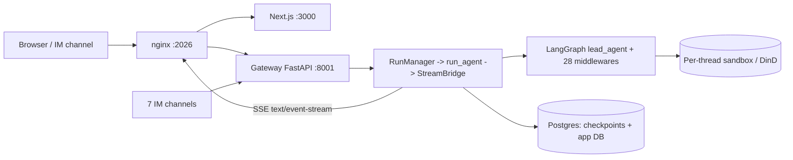

# Phase 2 — Architecture

## Runtime shape
- **Entry:** nginx (`deer-flow-nginx`, host :2026) → Gateway FastAPI (`app/gateway/app.py`, :8001) + Next.js frontend (:3000). Public tunnel maps nova.alilabsx.com → localhost:2026 (see memory: public-is-the-same-box).
- **Agent runtime is embedded in Gateway** (not a separate langgraph server): `RunManager` + `run_agent()` + `StreamBridge` in `packages/harness/deerflow/runtime/`. nginx rewrites `/api/langgraph/*` → Gateway `/api/*`.
- **Sandbox:** per-thread, `LocalSandboxProvider` / AIO SDK backend (`community/aio_sandbox/`), Docker-in-Docker via `docker-compose.dood.yaml`.

## Middleware order (app.py:399-433) — CORRECT
Registration (add order): AuthMiddleware(400) → CSRFMiddleware(403) → AuthRateLimitMiddleware(419) → CORSMiddleware(427, if origins configured).
Starlette runs **last-added = outermost = first**, so execution is: **CORS → RateLimit → CSRF → Auth → routers**. Flood rejection before auth/CSRF ✅. CORS outermost so headers attach to error responses ✅.
- ⚠️ Rate limiter is `AuthRateLimitMiddleware` — scoped to **auth endpoints only**. General API (agent runs, /api/threads, sandbox) has **no gateway-level rate limit** → cost-control gap (Phase 7 / PROD).
- ⚠️ In-memory rate limiter unless `stream_bridge.type=redis` — per-replica quota bypass under horizontal scale (the code comment acknowledges this). Redis is available in the sandbox image but the live stream bridge config must select it (Phase 7).
- CORS `allow_credentials=True` + `allow_origins=allowlist` — safe only if `get_configured_cors_origins()` never yields `*` (verify Phase 5).

## Coupling / fan-in (internal imports)
Highest fan-in: `runtime.user_context` (51), `config.app_config` (43), `config.paths` (42), `config` (41), `persistence.engine` (25), `execution.models` (25), `sandbox` (20). These are the blast-radius hubs — a change to `user_context` or `config.app_config` touches ~50/43 modules. No circular-import workarounds found (0 "avoid circular" markers) — clean import graph.

## Error handling census (prod code: harness/deerflow + app, excl tests/venv)
- `except Exception`: **672**
- bare `except:`: **0** (good)
- `except …: pass` (silent swallow): **90** → Phase 3 triage target (some legitimate best-effort cleanup, some may hide real failures).
- `asyncio.create_task(...)` fire-and-forget (no var/callback): **27**. Sampled `_auto_verify_preview` (dev_server.py:488) and `_watch_remote_cancel` — bodies are wrapped in try. Discord typing/reaction tasks (discord.py:331-442) are unguarded → low-risk lost-exception noise (Phase 3).

## test_no_cross_references.py — what it actually enforces
NOT an architectural "no cross-references" rule. It is a **project-separation gate**: forbids the strings `ali-kernel`/`ornith` (two other private projects) anywhere in the tree, while explicitly ALLOWING `deerflow`/`deer-flow` self-references. So it prevents leaking sibling-project names, not internal module coupling. README/AUDIT framing as isolation enforcement is misleading.

## Top architectural risks
1. Cost/DoS: no general-purpose rate limit; only auth endpoints are throttled.
2. Horizontal-scale correctness: in-memory rate limiter + (Phase 8) in-process caches ⇒ Gateway is effectively single-replica-correct.
3. `user_context`/`config.app_config` are god-hubs (50+/43 fan-in) — regression blast radius.
4. 90 silent `except: pass` sites — failure masking.
5. Embedded agent runtime in Gateway ⇒ backend source edits drop live SSE (memory: backend-edits-kill-live-runs); no process isolation between API and long agent runs.
